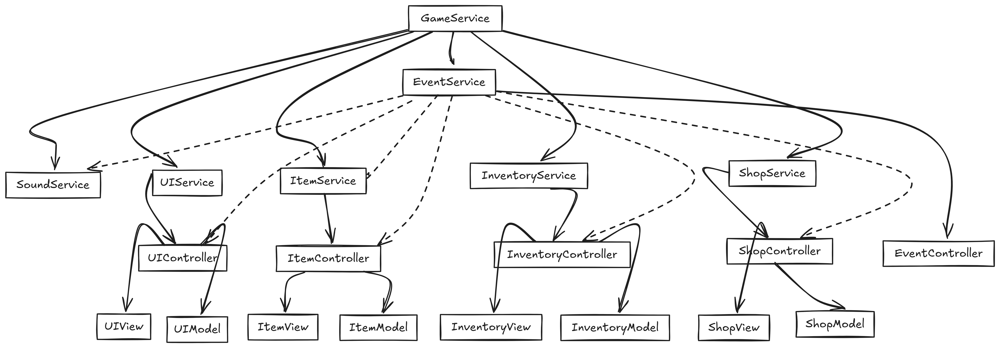

# Inventory-Shop-Simulator

This project is a shop and inventory management system with interactive gameplay mechanics. Players can trade items, gather resources. The system is designed using **Service Locator**, **Dependency Injection**, **Model-View-Controller (MVC)**, and the **Observer Pattern**, ensuring modularity and scalability.

---

## Gameplay Elements

### **1. Item Types**
- **Materials**: Resources used for crafting or trading.
- **Weapons**: Combat-related items for attack or defense.
- **Consumables**: Items that provide temporary boosts or effects (e.g., potions).
- **Treasure**: Rare and valuable items that can significantly increase the player's currency.

### **2. Rarity Types**
- **Very Common**: Frequently found items with low value and minimal impact.
- **Common**: Standard items with moderate value.
- **Rare**: Valuable items that are less frequently available.
- **Epic**: High-value items with significant gameplay effects.
- **Legendary**: Extremely rare and valuable items with unique properties.

### **3. Inventory Constraints**
- **Maximum Weight**: The cumulative weight of items in the inventory must not exceed the player's capacity.
- **Dynamic Weight Updates**: Inventory weight updates dynamically with every item added or removed.
- **Weight-Dependent Gameplay**: Certain actions, like resource gathering or buying items, are disabled when the inventory is full.

### **4. Currency System**
- Players start with no money.
- Currency increases when items are sold.
- Currency decreases when items are bought.
- Displayed dynamically in the UI for real-time feedback.

### **5. Gameplay Enhancements**
- **Gather Resources**:
  - Button allows players to collect random resources based on rarity.
  - Disabled when the inventory reaches maximum weight.

- **Buy/Sell Mechanics**:
  - **Buying**: Requires sufficient currency and available weight in the inventory.
  - **Selling**: Adds currency and frees up inventory weight.

### **6. UI Components**
- **Shop Tabs**: All, Materials, Weapons, Consumables, and Treasure.
- **Inventory Panel**: Shows item details like icon, description, rarity, weight, and value.
- **Notifications**: Popups for insufficient currency, full inventory, or successful transactions.

### **7. Sound and Feedback**
- Sounds are triggered during transactions, errors, and resource gathering.
- Temporary overlays for actions like "You bought [Item Name]" or "You sold [Item Name]" improve clarity.

### **8. Requirements to Features Mapping**
| **Requirement**               | **Implemented Feature**                                                                 |
|--------------------------------|-----------------------------------------------------------------------------------------|
| Item types (Materials, etc.)   | Shop and Inventory tabs categorized by item type.                                       |
| Rarity system                  | Randomized resource gathering based on rarity proportional to inventory value.          |
| Inventory weight constraints   | Dynamic weight updates; maximum weight prevents further actions like buying/gathering.  |
| Buy/Sell mechanics             | Transaction logic integrated with sound and UI feedback.                                |
| Notifications                  | Popups for insufficient currency or weight limits.                                      |

### **9. Item Properties**
- **Icon**: Visual representation of the item.
- **Description**: Text detailing the item's purpose.
- **Buying Price**: Cost of the item in the shop.
- **Selling Price**: Value of the item when sold.
- **Weight**: Affects inventory constraints.
- **Type**: Type of the item.
- **Rarity**: Determines availability and gameplay impact.
- **Quantity**: Number of items owned or available.

### **10. Player Progression**
- Start with an empty inventory and no money.
- Gather resources to build inventory and earn currency.
- Buy rare or useful items to maximize value and efficiency.
- Sell less valuable items to manage inventory weight and increase currency.

---

## Architectural Overview

The system uses **Service Locator**, **Dependency Injection**,  **MVC**, and the **Observer Pattern**. Below is the block diagram illustrating the architecture:

---

### Services and Components

1. **Game Service**: The central service responsible for initializing all other services using a private Service Locator.
   
2. **Event Service**: Implements the Observer Pattern for event-driven communication. It manages all events acting as mediators between services.
   - **Controller**: Inherits from EventController to manage event registrations and notifications.

3. **Sound Service**: Handles immersive sound effects for actions like buying/selling and resource gathering.
   - **Scriptable Objects**: 
      - `SoundScriptableObject` centralizes sound configurations.

4. **UI Service**: Handles user interactions and dynamically updates UI elements like inventory and shop panels.
   - **Controller**: Manages user interactions and dynamic UI updates.
   - **Model**: Placeholder for future enhancements.
   - **View**: Handles rendering of UI panels dynamically.

5. **Item Service**: Manages item-related data and logic, including creation of Item Controllers.
   - **Controller**: Handles item-related actions (e.g., create, delete).
   - **Model**: Stores runtime item data (e.g., weight, rarity).
   - **View**: Manages item visual representation in the UI.
   - **Scriptable Objects**: 
     - `ItemScriptableObject`: Centralized data for item properties.
     - `ItemDatabaseScriptableObject`: Manages a collection of items for use in the game.

6. **Inventory Service**: Controls inventory constraints like weight and item slots, while providing real-time updates.
   - **Controller**: Handles inventory constraints like weight and slots.
   - **Model**: Tracks inventory contents and runtime updates.
   - **View**: Displays inventory items dynamically.
   - **Scriptable Object**: `InventoryScriptableObject` for inventory-specific configurations.

7. **Shop Service**: Manages shop functionalities like categorized navigation and buying/selling items.
   - **Controller**: Manages buying/selling logic and navigation.
   - **Model**: Tracks shop inventory and item availability.
   - **View**: Dynamically renders shop items.
   - **Scriptable Object**: `ShopScriptableObject` for shop data.

8. **Utilities**:
   - `ReadOnlyDrawer`: Custom inspector drawer for readonly properties in the Unity Editor.

---

## Events

Here are the key events used in the system and their descriptions:

1. **Item Service**:
   - `OnCreateItemEvent`: Creates and returns an item controller for the specified section.
   - `OnShowItemEvent`: Displays items of a specific type in a section (Shop/Inventory).
   - `OnDestroyItemEvent`: Removes an item from a section (Shop/Inventory).

2. **Shop Controller**:
   - `OnShopAddItemEvent`: Adds an item to the shop when selling from inventory.
   - `OnBuyItemEvent`: Triggers the item-buying logic.

3. **Inventory Controller**:
   - `OnInventoryAddItemEvent`: Adds an item to inventory when buying from the shop.
   - `OnSellItemEvent`: Triggers the item-selling logic.

4. **UI Controller**:
   - `OnBuySellButtonClickEvent`: Handles buy/sell button clicks and their respective actions.
   - `OnShopUpdatedEvent`: Updates the Shop UI dynamically.
   - `OnInventoryUpdatedEvent`: Updates the Inventory UI dynamically with weight and slots.
   - `OnItemClickEvent`: Displays an item’s UI details when clicked.
   - `OnPopupNotificationEvent`: Triggers popups for notifications.
   - `OnSetButtonInteractionEvent`: Enables/disables buttons dynamically.
   - `OnCreateItemButtonViewEvent`: Instantiates and returns an item button prefab.
   - `OnCreateMenuButtonViewEvent`: Instantiates and returns a menu button prefab.

5. **Sound Service**:
   - `OnPlaySoundEffectEvent`: Plays a specific sound effect (e.g., transaction, error).

---

## Script and Asset Hierarchy

1. **Scripts**:
   - Organized by feature: `Editor`, `Event`, `Main`, `UI`, `Inventory`, `Shop`, `Items`, `Sound`, etc.

2. **Assets**:
   - **Sounds**: From Outscal.
   - **Prefabs**: Self-created for UI components.
   - **Art**:
     - `Art/UI Icons/Item`: Organized into folders for each item type (e.g., Materials, Weapons, Consumables, Treasure).
     - Icons were generated via ChatGPT for consistency.

---

## Development Workflow

### Branches
1. **feature/game-screen-ui**: Initial UI framework for Inventory and Shop panels.
2. **feature/item-properties**: Created Scriptable Objects for item configurations.
3. **feature/item-mvc**: Modularized item logic into MVC.
4. **feature/inventory-mvc**: Implemented MVC for inventory management.
5. **feature/shop-mvc**: Developed shop system with categorized navigation.
6. **feature/service-locator-di**: Centralized services with Dependency Injection.
7. **feature/buying-selling-items**: Integrated buying/selling mechanics.
8. **feature/gather-resources**: Added dynamic resource gathering mechanics.
9. **feature/item-ui-enhancements**: Improved UI clarity with detailed feedback.
10. **feature/event-service**: Implemented the Observer Pattern for communication.
11. **feature/sound-service**: Added sound effects for gameplay immersion.
12. **feature/ui-mvc**: Enhanced UI structure using MVC.
13. **feature/gameplay-enhancements**: Polished gameplay with additional features.
14. **feature/documentation**: Prepared the README and added Block diagrams.

---

## Video Demo

[Watch the Gameplay Demo](https://www.loom.com/share/demo-link)

---

## Play Link

[Play the Game](https://outscal.com/narishabhgarg/game/play-shop-inventory)

---